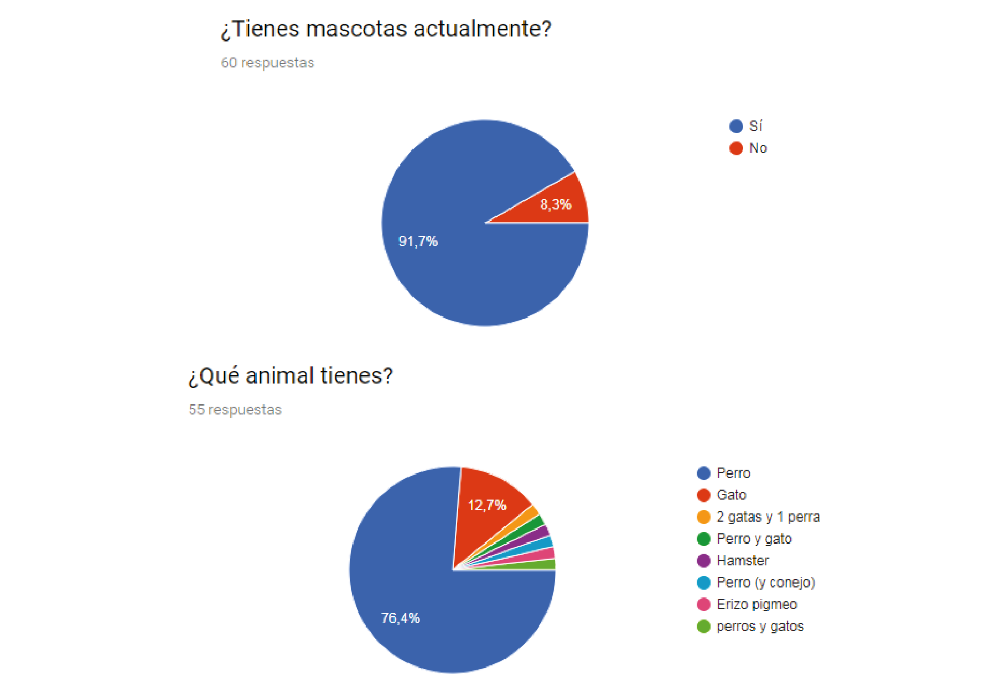
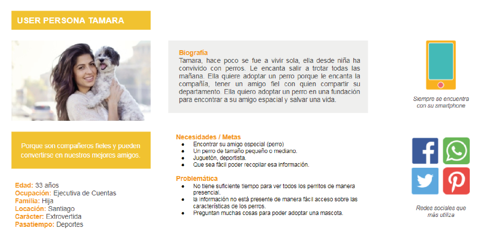

# Fundación Stuka

Fundación Stuka es una organización que ayuda a los animales en este caso perros. Cuentan con un refugio de 120 perros ubicado en Casa Blanca. Cuentan con un sitio web en donde se pueden adoptar a los animales. El proyecto se encuentra enfocado en mejorar la experiencia de usuario, en donde sea más llamativo y fácil de usar el proceso de adopción en el sitio web.

## Desarrollado para

[Laboratoria](https://marvelapp.com/63a9d8d/screen/39802648)

## DESCUBRIMIENTO E INVESTIGACIÓN
***

**Día 1:**
Comenzar la etapa de investigación, Recopilar información sobre sitios de la competencia, estudios de Mercado, encuestas y entrevistas. 

Realizar un **Benchmark** para comparar ciertos sitios web y obtener observaciones.

**Observaciones:**

Los sitios internacionales observados resuelven mejor la problemática al presentar al perro con más información y fácil acceso a ella. Las fotografías tienen una mejor calidad, se presenta en varias vistas en uno de los sitios se muestra un pequeño vídeo del animal, mostrando cómo se desenvuelve en el entorno. La descripción del animal es más lúdica, aparte de su descripción básica como el peso, sexo, carácter. Se presenta la historia de las condiciones de cómo llegó al refugio. 

**Día 2:**
Guión entrevista.
*Objetivos*
- Conocer las motivaciones de los posibles adoptantes.

- ¿Qué tan informados están los posibles adoptantes con fundaciones?.
- ¿Cuáles son las necesidades de querer adoptar?.
- ¿Cómo buscan la información para poder adoptar?
- Conocer experiencias de usuarios que ya han adoptado
- Experiencia de los usuarios en buscar una mascota.

**Día 3:**
Encuesta online, obtener dato cuantitativo ¿cómo llegó a sus hogares sus mascotas?.

*Observaciones:*
La gran mayoría tiene perro como mascota y el proceso de llegada al hogar en su mayoría es por adopción o encontrado en la calle y luego adoptado. Al momento de tomar la decisión de tener una mascota, influye el entorno tales como el espacio, tamaño, entre otros. Pero el factor más importante al momento de decidir para tener una mascota es el amor hacía ellos.

**Día 4:**
Estudio de Mercado, Se buscó información sobre la población el porcentaje que poseen perro en sus hogares.

### Por qué razón se adopta un perro
El 54,8% de los hogares tiene un perro y el 20,9% un gato.

**Razones**  También se puede analizar el perfil de los dueños de mascotas. Los resultados muestran que el porcentaje de mascotas de familias con hijos es mayor que el de familias sin hijos o personas solas. Es habitual que las familias con niños tengan mascotas no solo por los niños, sino también porque resulta más fácil cuidar bien a una mascota si colaboran más personas. También es más frecuente que adopten personas que tuvieron mascota cuando eran niños. 

Estas son, entre otras, las razones por las que se desea adoptar una mascota:

- Por su amor incondicional por el propietario y demás miembros de la familia.
- Porque no juzgan ni la personalidad ni el aspecto de las personas.
- Porque son compañeros fieles y pueden convertirse en nuestros mejores amigos.
- Porque son muy bonitos.
- Porque siempre están contentos y nos contagian su buen humor.
- Por los beneficios para la salud que conllevan el paseo y los cuidados al perro.
- Porque ayudan a fortalecer el sistema inmunitario de los niños y reducen la posibilidad de desarrollar alergias.
- Porque son juguetones y divertidos.
- Porque mejoran la autoestima de sus propietarios, especialmente en el caso de los niños y de las personas que viven solas.
- Porque al acariciar y abrazar a una mascota, se reduce el nivel de estrés.

**Estudio Mercado** Según estudio Chile 3D 2014 un 65.3% de los chilenos tiene alguna mascota. Un 54,8% de los encuestados declara tener perro, un 20,9% declara tener gato y un 2,8% declara tener algún otro tipo de mascota.

En 2011, PetSmart Charities en EE. UU. realizó un estudio de mercado para examinar las actitudes y comportamientos de las personas respecto a la adopción de mascotas. Se pueden adquirir un perro o gato de diversas maneras: Acudiendo a fundaciones en las jornada de adopción. a través de miembros de familia, criaderos de animales, adoptando animales que encontramos abandonados. 
el 19% se adoptan en una fundación de animales.
Las principales motivaciones para adoptar mascotas en una fundación de animales incluyen el deseo de salvar una vida (73%), la búsqueda de un compañero especial (72%) y el deseo de reducir el número de mascotas callejeras sacrificadas (72%).
Las razones alegadas para no adoptar en una protectora de animales son, entre otras: querer un animal de pura raza (13%), no encontrar el animal deseado (17%), un proceso de adopción demasiado complejo (10%) y encontrar las protectoras de animales deprimentes o no poder acudir por incompatibilidad horaria (7%).

**Vínculos** Existen muchas razones para adoptar una mascota.  Algunos eligen una raza que les gusta especialmente o que les parece que se adaptará mejor a su estilo de vida. Otros deciden adoptar en un refugio de animales porque les parece una forma de ayudar.  Independientemente de la procedencia de una mascota, la mayoría de propietarios establecen un estrecho vínculo con ella, la ven como un miembro más de la familia y disfrutan de muchos de los beneficios previamente listados.

### SÍNTESIS DE LA INVESTIGACIÓN

**Día 5:**
Customer Journey Map, se realiza un testeo con el sitio web actual. La tarea era que el usuario vivía en un depto,  que realiza deporte y le gustaría adoptar una perro de sexo hembra de tamaño mediano y activa para realizar en su compañía las actividades.

*Observaciones:*
al usuario le costó mucho trabajo cumplir la tarea, no lograba comprender el tamaño del perro con sólo ver imagen o la información que observaba no era suficiente, sintió frustración, al momento de escoger un perro. Al querer enviar el formulario de pre-adopción, le tomó tiempo en entender las preguntas y la forma del enviarlo, no quedó claro. 

Una observación importante al dar sus datos aún no se ha comunicado con ella para saber en qué proceso está en la adopción. Cómo dato importante y para que se logre la adopción es fundamental la comunicación después del envió del formulario, parte de mi investigación en dos sitios nacionales realice dos adopciones y dentro de la semana recibí una llamada de los refugios para continuar con el proceso de adopción.

**Día 6:**
User persona, realizar el trabajo de conocer más a los usuarios que desean adoptar a través del sitio web.

*Observaciones:*
Los usuarios tienen un amor hacia los animales, muchos en la niñez tuvieron una mascota y anhelan esos recuerdos, el deseo de querer ayudar también es un punto importante a la hora de tomar la decisión de adoptar. Preocupación del entorno del animal, Empatía hacía los animales.

###Definir Conclusiones

**Día 7:**

**Problem Statements**
{Tamara} necesita un espacio para poder adoptar un perro, así lograr tener un amigo con quien hacer sus actividades.

**HMW (How Might o cómo podríamos)**
- Cómo podríamos ayudar a nuestro usuario que encuentre un perro que se ajuste a su perfil.

**WHAT IF**
- Qué pasaría si existiera filtros para categorizar por tamaños, sexo y personalidad entre otros.
- Qué pasaría si mostrarán fotografías de los perros en sus diferentes vistas.
- Qué pasaría si en el sitio hubiera una reseña de cómo llegó el perrito a la fundación.
- Qué pasaría si aparezca los perros que ya están en proceso de adopción.
- Qué pasaría si aparece vídeos de los perros de la fundación.
- Qué pasaría que pudieran también apadrinar a un perro de la fundación.
- Qué pasaría si la descripción del perro se presentará de una manera lúdica y hablada en primera persona, es el perro contando su historia.

### Idealización
***

Día 8:
Arquitectura de la Información:

*Observaciones:*
Enfocado en la búsqueda de adoptar, pero de una manera simple, iniciara en el home del sitio, con un lenguaje en primera persona de un perro, donde invita a comenzar la búsqueda del perro respondiendo un cuestionario y los perros que aparezcan sea el reflejo de las respuestas de la encuesta.

**¿Qué estructura va a tener?**
Manteniendo una coherencia con el diseño. Simple mediante responda el cuestionario aparece la siguiente pregunta, son con alternativas de fácil respuesta. La última pregunta es enfocada en el carácter del perro (la fundación los tiene definidos). Con una breve descripción a que a punta cada carácter del animal.
Al responder las preguntas se presenta las alternativas con fotografías atractivas, también tiene un buscador para buscar un perro en específico ya que la fundación realiza jornadas de adopción. En la ficha del animal, se aprecian más vistas de imágenes y un pequeño vídeo para observar cómo se desenvuelve el animal. El lenguaje usado en las fichas será en primera persona, el perro estará comentando su descripción y cómo llegó a la fundación, su carácter. Para evocar más emocionalidad y que sea muy parecido a la experiencia de encontrarse un perro en condición de abandono en la calle.

### PRESENTACIÓN DE POSIBLE SOLUCIÓN A LA FUNDACIÓN STUKA
***

Lograron realizar la tarea asignada de poder adoptar a Acelga. Se aclaró los puntos. En la actualidad usuarios que adoptan perros a través del sitio al momento de generar el contacto directo a través de entrevistas telefónicas o posibles visitas. Solicitan más fotos del animal, un vídeo o la historia de cómo llegó a la fundación. Y la encargada de Adopción debe generar la búsqueda con los técnicos veterinarios que les mande fotos, vídeos y la historia del animal de como llego a la fundación. 

## Prototipo
***
Al momento de realizar el prototipo, investigue en otros sitios cómo estaban hechos los cuestionarios. Cómo se presentaba las imágenes de los perros en otros sitios. 
