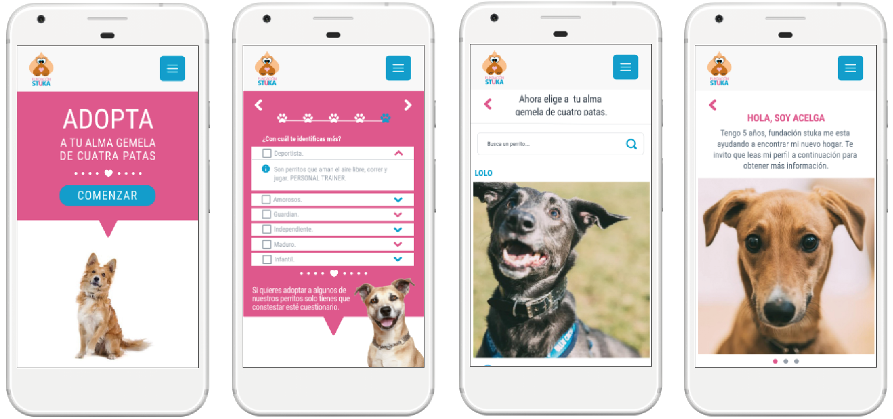
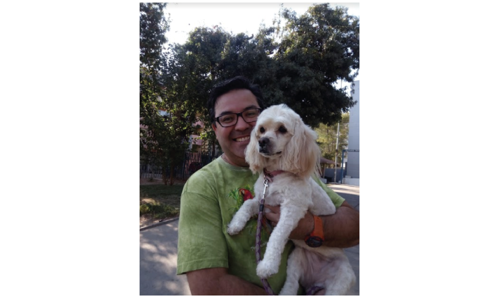
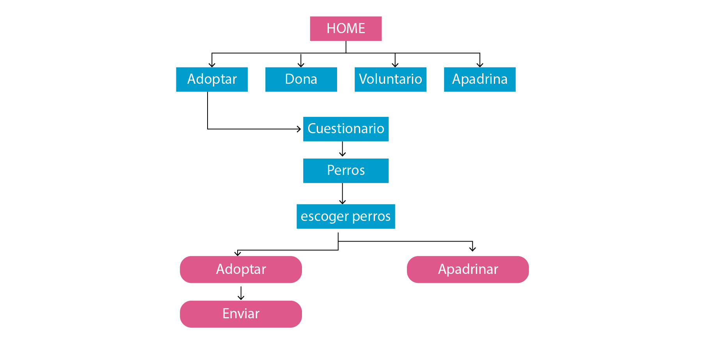

# Fundación Stuka

Fundación Stuka es una organización que ayuda a los animales. Cuentan con un refugio de 120 perros ubicado en Casa Blanca. Cuentan con un sitio web en donde se pueden adoptar a los animales. El proyecto se encuentra enfocado en mejorar la experiencia de poder adoptar a los perritos a través del sitio web.

## Desarrollado para

[Laboratoria & Fundación Stuka](https://marvelapp.com/63a9d8d/screen/39802648)

### Proceso de diseño

### Objetivo
Realizar un proyecto individual y tema libre. Escogí mejorar la experiencia de adopción en el sitio web fundación Stuka en donde soy voluntaria desde el año 2013. El tema de la sobrepoblación canina es un problema país. La mayoría de los perros callejeros alguna vez tuvieron un dueño que los abandonó o se les perdió. Por eso es importante en el sitio web, se entregue toda la información de los perros que se encuentren en búsqueda de una segunda oportunidad. 

# Descubrimiento e investigación
### Research Cualitativo

Se comenzó con realizar el guión de la entrevista para armar un set de preguntas para priorizar los temas de la investigación. Se realizaron 4 entrevistas para conocer a los usuarios y también para conocer la si tienen mascotas.

objetivos de las preguntas son:
* Conocer las motivaciones de los posibles adoptantes.
* ¿Qué tan informados están los posibles adoptantes con fundaciones?.
* ¿Cuáles son las necesidades de querer adoptar?.
* ¿Cómo buscan la información para poder adoptar?
* Conocer experiencias de usuarios que ya han adoptado
* Experiencia de los usuarios en buscar una mascota.

Se realizó entrevista a 4 usuarios, el contexto de las entrevistas fueron en la calle escogidos al azar o si se encontraban paseando a su mascota. 

**Conclusiones:**
En las entrevistas los usuarios se expresaban con mucho cariño y amor al momento de hablar sobre sus mascotas. El cómo llegaron a sus hogares fueron en circunstancias en donde el perro enfrenta alguna dificultad  por ejemplo en un accidente, o desnutrición, eso generó empatía de querer ayudarlos y protegerlos. 

### Testing Video

Se realizó un testing de vídeo a través de la herramienta Loom. se realiza un testeo con el sitio web actual. La tarea era que el usuario vivía en un depto,  deportista y le gustaría adoptar una perro de sexo hembra de tamaño mediano y activa para realizar en su compañía las actividades.

**Conclusiones:**

al usuario le costó trabajo cumplir con la tarea asignada, no lograba observar  con la imagen del perro su tamaño o las características no era suficiente, sintió frustración, al momento de escoger un perro ya que era importante que cumpliera con las características dada, el usuario comprendía la importancia de escoger bien al animal . Al querer enviar el formulario de pre-adopción, le tomó tiempo en entender las preguntas y la forma del enviarlo, no le quedó claro.  Al final escogió a una perrita por su carita le produjo ternura.

Al rellenar el formulario, quedo en espera que se comunicaran con ella para continuar con el proceso de adopción y testo. Es fundamental la comunicación después del envió del formulario, parte de mi investigación en dos sitios nacionales realice dos adopciones en una fundación me llamaron al día siguiente y la siguiente fundación se contactaron conmigo al segundo día por whatsaap. La fundación stuka se contactó con el usuaria al cuarto día. 

### Research Cuantitativo
**Estudio Mercado**

Se buscó información sobre la población Canina en los Hogares.

**Por qué razón se adopta un perro**
El 54,8% de los hogares tiene un perro y el 20,9% un gato.
Razones También se puede analizar el perfil de los dueños de mascotas. Los resultados muestran que el porcentaje de mascotas de familias con hijos es mayor que el de familias sin hijos o personas solas. Es habitual que las familias con niños tengan mascotas no solo por los niños, sino también porque resulta más fácil cuidar bien a una mascota si colaboran más personas. También es más frecuente que adopten personas que tuvieron mascota cuando eran niños.

Estas son, entre otras, las razones por las que se desea adoptar una mascota:

* Por su amor incondicional por el propietario y demás miembros de la familia.
* Porque no juzgan ni la personalidad ni el aspecto de las personas.
* Porque son compañeros fieles y pueden convertirse en nuestros mejores amigos.
* Porque son muy bonitos.
* Porque siempre están contentos y nos contagian su buen humor.
* Por los beneficios para la salud que conllevan el paseo y los cuidados al perro.
* Porque ayudan a fortalecer el sistema inmunitario de los niños y reducen la posibilidad de desarrollar alergias.
* Porque son juguetones y divertidos.
* Porque mejoran la autoestima de sus propietarios, especialmente en el caso de los niños y de las personas que viven solas.
* Porque al acariciar y abrazar a una mascota, se reduce el nivel de estrés.

**Estudio Mercado**
Según estudio Chile 3D 2014 un 65.3% de los chilenos tiene alguna mascota. Un 54,8% de los encuestados declara tener perro, un 20,9% declara tener gato y un 2,8% declara tener algún otro tipo de mascota.
En 2011, PetSmart Charities en EE. UU. realizó un estudio de mercado para examinar las actitudes y comportamientos de las personas respecto a la adopción de mascotas. Se pueden adquirir un perro o gato de diversas maneras: Acudiendo a fundaciones en las jornada de adopción. a través de miembros de familia, criaderos de animales, adoptando animales que encontramos abandonados. el 19% se adoptan en una fundación de animales. Las principales motivaciones para adoptar mascotas en una fundación de animales incluyen el deseo de salvar una vida (73%), la búsqueda de un compañero especial (72%) y el deseo de reducir el número de mascotas callejeras sacrificadas (72%). Las razones alegadas para no adoptar en una protectora de animales son, entre otras: querer un animal de pura raza (13%), no encontrar el animal deseado (17%), un proceso de adopción demasiado complejo (10%) y encontrar las protectoras de animales deprimentes o no poder acudir por incompatibilidad horaria (7%).
Vínculos Existen muchas razones para adoptar una mascota. Algunos eligen una raza que les gusta especialmente o que les parece que se adaptará mejor a su estilo de vida. Otros deciden adoptar en un refugio de animales porque les parece una forma de ayudar. Independientemente de la procedencia de una mascota, la mayoría de propietarios establecen un estrecho vínculo con ella, la ven como un miembro más de la familia y disfrutan de muchos de los beneficios previamente listados.

### Benchmark

Los sitios Web internacionales observados se puede apreciar en su portales de adopciones. Que al presentar, características de cada perrito son hablados en primera persona, el animal expresando su historia cómo llegó a la organización y las condiciones que se encuentra.

# Síntesis y definición
### User Persona - Arquetipos

Elabore **User personas** enfocados en en un usuario que tienen mascotas. Para comprender más las necesidades de los usuarios al momento de querer adoptar.

### User Journey Map

Se realizó un mapa de viaje, para identificar los puntos críticos de los usuarios en las diferentes etapas de cuando quieren adoptar un perro en el sitio web actual de la fundación. De acuerdo a la investigación del testing vídeo.

### Problem Statement

A partir del Customer Journey Map se definieron las principales necesidades de los usuarios.
* Se necesita cumplir ciertas características para poder adoptar un perro.

### HMW / What if?
Luego del planteamiento del problema se definieron las preguntas claves ¿Cómo podríamos? (HMW) (What if?), estas preguntas sirvieron para entender más los problemas y desarrollar mejores hipótesis. 
* Qué pasaría si existiera filtros para categorizar por tamaños, sexo y personalidad entre otros.
* Qué pasaría si mostrarán fotografías de los perros en sus diferentes vistas.
* Qué pasaría si en el sitio hubiera una reseña de cómo llegó el perrito a la fundación.
* Qué pasaría si aparezca los perros que ya están en proceso de adopción.
* Qué pasaría si aparece vídeos de los perros de la fundación.
* Qué pasaría que pudieran también apadrinar a un perro de la fundación.
* Qué pasaría si la descripción del perro se presentará de una manera lúdica y hablada en primera persona, es el perro contando su historia.

# Ideación
### Propuesta de Valor

* Enfocado en la búsqueda de adoptar, pero de una manera simple, iniciara en el home del sitio web, donde invitan a comenzar la búsqueda respondiendo un cuestionario.

### Arquitectura de la información
La arquitectura de la información me ayudó a organizar, etiquetar y diseñar el contenido que tendrá el sitio web. Esto me permite dar estructura, completar objetivos y dar sentido a la información. 

### User flow y Testing
Se utilizó user flow para determinar el trayecto que realizarán los diferentes usuarios. Al momento de iniciar una búsqueda de los perros en adopción en la fundación. 

Los wireframes fue testeado por funcionarios de la fundación en donde lograron realizar la tarea asignada:
* Responder el cuestionario de acuerdo a los criterios de un supuesto adoptante
* Adoptar a Acelga una perrita de la fundación.

Se reafirma la hipótesis de entregar mayor información y características de los perros en adopción, ya que en la actualidad la voluntaria de las adopciones del sitio web, al momento de comunicarse con ella son los mismos posibles adoptantes le solicitan más fotografías de los perros, la historia de cómo llegó el animal o vídeo de él.

# Prototipo de alta fidelidad
Las observaciones hechas en el testing fueron corregidas, para así mejorar la experiencia del usuario al momento de iniciar la búsqueda de un perro en adopción. Este nuevo prototipo fue hecho con la herramienta Marvelapp.

